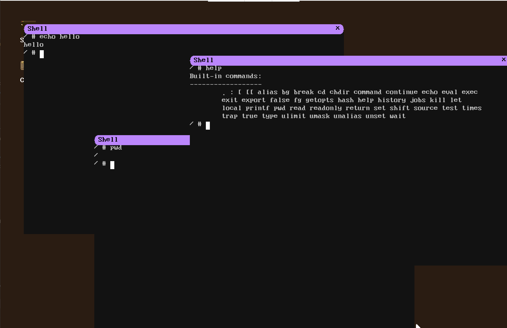
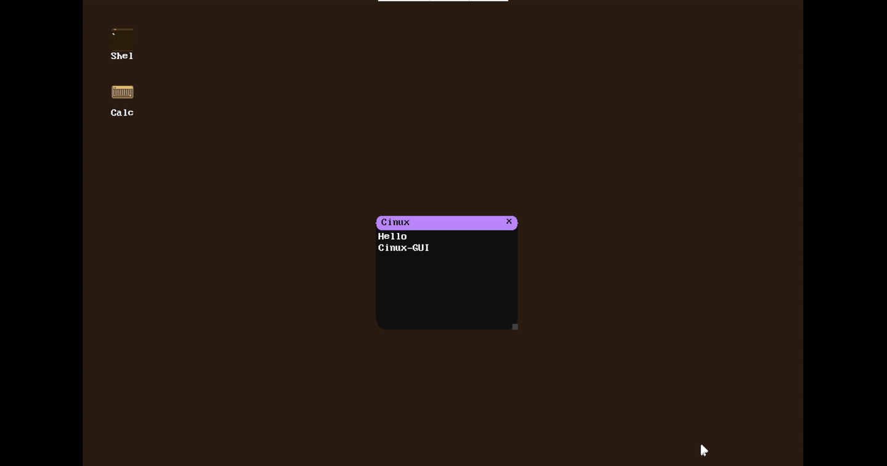

<div align="center">

# 🐧 Cinux

### x86_64 操作系统 · 现代 C++ 实现 · SMP 多核 · TCP/IP · GUI 桌面 · GCC 自举

[](document/changelogs/v1.0.0.md)
[](LICENSE)
[]()
[]()
[]()

一个基于 x86_64 架构的操作系统——从 **Bootloader 到 GUI 桌面、从内核到 GCC 自举**,全链路实现。

> **Note:** 本项目迁移自教程操作系统 [Cinux](https://github.com/Awesome-Embedded-Learning-Studio/Cinux-Book)

</div>

---

## ✨ 项目简介

**Cinux** 是一个基于 x86_64 架构、采用现代 C++17 编写的操作系统。

> 💡 **为什么叫 Cinux?**
> - C/C++'s Linux, 也就是尝试重新再写一个基于 C/C++ 的 Linux
> - CharlieChen's *nux（逃）

13 个 Feature 域覆盖内核基础设施、内存管理、SMP 多核、设备驱动、VFS、网络协议栈、IPC、安全、用户态运行时、GUI 分离与 GCC 自举生态。**目标平台 QEMU / WSL2 KVM**。

---

## 🖼️ Screenshots

<p align="center">
  
  
</p>
<p align="center">
  <em>GUI 桌面环境（左） · CLI 终端环境（右）</em>
</p>

<p align="center">
  
  
</p>
<p align="center">
  <em>从启动到 Shell（左） · 使用Buildroot编译的Rootfs（右）</em>
</p>

<p align="center">
  
</p>
<p align="center">
  <em>使用gcc, g++编译C/C++文件，支持多达100+的syscall!</em>
</p>

---

## 🌟 特性亮点

<table>
<tr>
<td width="50%">

🧠 **完整 x86_64 内核**
Bootloader → Mini Kernel → Big Kernel → User Space → GUI,全链路打通;113 个系统调用,对齐 Linux ABI

</td>
<td width="50%">

⚡ **SMP 多核**
`-smp 2` 双核 online;per-CPU 架构 + IPI/trampoline + 多核调度 + lockdep 锁序图检测

</td>
</tr>
<tr>
<td>

📁 **多文件系统 + 三套存储**
ext2 读写 / ext4 只读 / tmpfs / ProcFS / DevFS;**NVMe + VirtIO-blk + AHCI** 三套块设备驱动;Dentry Cache + POSIX flock + 运行时 mount

</td>
<td>

🌐 **TCP/IP 协议栈**
以太网 / ARP / IPv4 / ICMP / UDP / TCP(握手/序号-ACK/挥手)+ Socket API;真 `ping 10.0.2.2`

</td>
</tr>
<tr>
<td>

🖥️ **GUI 用户态桌面**
[Cinux-GUI](https://github.com/Awesome-Embedded-Learning-Studio/Cinux-GUI) Compositor + Widget 树 + Terminal;**用户态进程**跑(`/dev/fb0` mmap + `/dev/input`),xHCI USB HID 键鼠

</td>
<td>

👨‍💻 **GCC 自举**
Cinux 上 `gcc hello.c && ./a.out`、`g++ hello.cpp`,cc1→as→ld 全闭环;默认 PIE;busybox init PID 1

</td>
</tr>
<tr>
<td>

🔒 **安全机制**
NXE + SMEP + SMAP(机制回读验证)+ ASLR + UID/GID + Stack Canary(-fstack-protector-strong)

</td>
<td>

🔧 **现代 C++17**
`constexpr` 编译期生成 GDT/IDT / RAII 锁 / `enum class` 驱动接口 / freestanding 零标准库 / `ErrorOr<T>` 无异常

</td>
</tr>
<tr>
<td colspan="2">

🔌 **musl 动态链接** — 移植 musl 作唯一 libc(不自建),kernel 做 PT_INTERP / interp 加载 / auxv,跑通 musl 动态 hello;双 libc 共存(musl 静态 busybox + glibc 动态 cc1)

</td>
</tr>
</table>

---

## 📋 完整功能清单

> 以下清单**交叉读源码确认**(syscall 注册表 / 驱动目录 / 各子系统实现文件),非仅靠文档声明。

<details>
<summary><b>🔍 点击展开完整功能清单(13 个子系统)</b></summary>

### 🧠 内核与启动链

- **启动链**:MBR(stage1)→ stage2(A20 / E820 / VESA 1024×768×32 / 实模式→保护模式→长模式 / BootInfo@0x7000)→ Mini Kernel(higher-half)→ Big Kernel → 用户态 → GUI
- **架构**:x86_64 长模式,higher-half 内核(`-mcmodel=kernel`),GDT/IDT `constexpr` 生成,IST1/IST2 独立中断栈
- **中断/系统调用**:LAPIC(xAPIC)per-CPU timer + IPI、IOAPIC GSI 路由、MSI-X、8259 PIC 兼容回退、SYSCALL/SYSRET(LSTAR/STAR/SFMASK)

### 📡 系统调用(113 个,对齐 Linux x86_64 ABI)

| 类别 | 实现 |
|---|---|
| 进程 | fork / vfork / clone / clone3(stub) / execve / waitpid / exit / exit_group / yield / getpid / getppid / set_tid_address / tkill |
| 进程组/会话 | setpgid / getpgid / setsid / getsid |
| 文件 I/O | read / write / pread64 / readv / writev / open / openat / close / creat / lseek / dup / dup2 / pipe / fcntl / flock / sendfile(stub) / ioctl |
| 文件系统 | stat / fstat / lstat / newfstatat / access / getdents / getdents64 / chdir / getcwd / mkdir / rmdir / unlink / rename / link / symlink / readlink / mknod / chmod / chown / umask / utimensat / mount / umount2 |
| 网络/Socket | socket / connect / accept / accept4 / bind / listen / sendto / recvfrom / shutdown / getsockname / getpeername / socketpair / setsockopt(stub) / getsockopt |
| 信号 | kill / tkill / rt_sigaction / rt_sigprocmask / rt_sigtimedwait / setitimer |
| IPC | futex / shmget / shmat / shmdt / shmctl |
| 时间 | nanosleep / clock_gettime / gettimeofday / time |
| 内存 | mmap / munmap / mprotect / brk |
| 凭证 | getuid / geteuid / getgid / getegid / setuid / setgid / getgroups / setgroups |
| 信息 | uname / sysinfo / getrusage / dmesg |
| I/O 多路 | poll / select |
| 其它 | getrandom / sched_getaffinity / arch_prctl / reboot / prlimit64(stub) / rseq(stub) / getcpu(stub) / set_robust_list(stub) / ping(自定义) / cinux_exit(自定义) |

### 💾 内存管理

- **按需分页**:VMA + 缺页处理;匿名页零填充,文件页走 Page Cache
- **CoW fork**:fork 标记 `FLAG_COW`,写时复制;设备映射(`FLAG_PCD`)直共享
- **Page Cache**:inode+offset 哈希,命中/回填/写失效,cache 所有权 refcount
- **Slab 分配器**:16~2048B 通用 cache + 专用 cache,double-free 毒哨兵,`kmalloc`/`kfree`
- **mmap/munmap/mprotect/brk**:VMA 合并/分裂/查找空闲区
- **每进程页表**:`AddressSpace` 拥有 PML4,execve 清用户映射
- **TLB shootdown IPI**:vector 0xE1,all-excl-self + invlpg + ack
- **refcount/mapcount 分离**:`PhysRef` 所有权 + `pte_count` 映射计数(防 lto_plugin UAF)

### ⚡ SMP 多核

- **-smp 2**:ACPI MADT 探测 AP,INIT-SIPI-SIPI + trampoline@0x8000 引导
- **per-CPU**:GS.base → PerCpu 块(kernel_stack / current),每 CPU 独立 GDT/TSS/idle
- **IPI**:reschedule(0xE0)唤醒 idle AP、TLB shootdown(0xE1)
- **lockdep**:per-CPU 持锁栈 + 全局锁序图 + AB-BA 死锁检测 + `assert_held`
- **RaceWatchpoint**(`RACE_DETECT`):`RACE_TOUCH` 抓"根本没锁"的跨 CPU 交错 → kpanic
- **迁移竞态修复**:`task->on_cpu` 防 ctx 保存/恢复竞态

### 🖥️ 设备驱动

| 类别 | 驱动 | 说明 |
|---|---|---|
| 存储 | NVMe / AHCI / VirtIO-blk | 三套块设备,均可作 boot disk(默认 AHCI),sync poll IO,512B 扇区 |
| 网络 | e1000 / VirtIO-net | TX/RX 环,SLIRP 用户态网络(`ping 10.0.2.2`) |
| 输入 | xHCI USB HID | boot keyboard + tablet(绝对指针)+ autorepeat;PS/2 键鼠回退 |
| 定时器 | PIT / HPET / RTC / LAPIC timer | PIT 100Hz 时钟源(mode 2)、HPET 单调时、RTC 墙钟、LAPIC per-CPU 抢占 |
| 控制台 | Serial 16550 / Console TTY / PTY | 行规范 + 信号,PTY master/slave 对(多终端) |
| 图形 | Framebuffer / PSF1 font | `/dev/fb0` mmap,2MB huge page 映射 |
| 平台 | PCI / MSI-X / ACPI(MADT/HPET) / 8259 PIC | 设备枚举、中断路由、拓扑发现 |

### 📁 文件系统与 VFS

- **ext2 / ext4**:统一驱动,**ext2 读写 / ext4 只读**;ext4 extent(depth-0 leaf)支持;inode cache;块大小 1/2/4K
- **tmpfs**:内存 FS,读写,`/tmp` 默认挂载
- **procfs**:`/proc/cpuinfo`、`/proc/meminfo`、`/proc/<pid>/{stat,cmdline}`
- **devfs**:`/dev/null`、`/dev/zero`、`/dev/console`、`/dev/ptmx`、`/dev/pts/N`、`/dev/fb0`、`/dev/event0`、`/dev/tty`(按调用者 controlling tty 动态解析)
- **ramdisk**:ustar initrd(早期引导文件)
- **VFS**:Dentry Cache(256 桶哈希;DevFs 动态 lookup 不缓存)、mount 表(最长前缀匹配)、符号链接(循环检测 max 40)、POSIX flock(SH/EX/UN + LOCK_NB)、fd 表(CLOEXEC)

### 🔌 IPC

- **pipe**:环形缓冲 + 阻塞 + `O_NONBLOCK` + SIGPIPE/BrokenPipe + EINTR
- **FIFO**:命名管道,内存名注册表
- **AF_UNIX socket**:字节流,bind/listen/accept/connect,4KB RX 环,accept 队列 4
- **socketpair**:AF_UNIX 匿名连接对
- **SysV shm**:shmget/shmat/shmdt/shmctl,物理页 + pte_count,IPC_RMID 延迟清理,SHM_RDONLY
- **poll/select**:共享引擎,pollfd 64 / fd_set,超时,POLLIN/OUT/HUP/ERR
- **futex**:用户态快速互斥

### 🌐 网络协议栈

- **L2**:以太网帧(14B 头),`NetDevice` 抽象,loopback
- **ARP**:缓存 + 异步请求/回复,自学习
- **IPv4**:20B 头 + 校验和 + L4 分发(ICMP/UDP/TCP),TTL=64
- **ICMP**:echo request/reply,raw socket 投递 reply
- **UDP**:无连接,端口 demux,8 槽 RX 环,自动临时端口,伪首部校验和
- **TCP**:三次握手 / 状态机(CLOSED…ESTABLISHED…FIN_WAIT)/ 四次挥手 / RST,8KB RX 环,accept 队列 8,序号-ACK
- **Socket API**:AF_INET / AF_UNIX,SOCK_STREAM / SOCK_DGRAM / SOCK_RAW,bind/connect/listen/accept/sendto/recvfrom/shutdown
- **SLIRP**:QEMU 用户态网络,10.0.2.2 网关,busybox ping 可用(SOCK_RAW + setitimer 每秒发包)

### 🚦 信号

- **22 个 POSIX 信号**(SIGHUP…SIGTTOU),默认动作表(Terminate / CoreDump / Ignore / Stop / Continue)
- **自定义 handler**:sigaction 安装,signal frame(user 栈)+ sigreturn trampoline(`int $0x80` @ USER_SIGRETURN_PAGE),RSP%16==8 对齐
- **信号掩码**:rt_sigprocmask(BLOCK/UNBLOCK/SETMASK),SIGKILL/SIGSTOP 不可挡
- **force_send**:同步故障(#PF/#UD)强制投递,绕过 SIG_IGN 防自循环
- **EINTR**:阻塞 IO(pipe/socket/poll)可被信号打断(`wait_queue_head` + `schedule_blocked` signal-aware);Mutex/futex/waitpid 不可打断
- **setitimer**:ITIMER_REAL → 周期 SIGALRM(PIT tick 驱动,periodic / one-shot)
- **作业控制**:SIGTSTP(^Z)/ SIGTTIN / SIGTTOU 经 PTY 行规范投递前台 pgrp;SIGCONT 恢复
- **SIGCHLD**:子退出通知 + waitpid 回收 + Zombie

### 🔒 安全

- **SMEP / SMAP**:CR4 开启(CPUID 门控),`stac`/`clac` + `access_ok` + 异常表修复
- **ASLR**:PIE base(0~16MiB)+ 栈(0~8MiB)+ mmap(0~1GiB)+ brk(0~16MiB)抖动
- **NX / W^X**:EFER.NXE,非可执行 VMA 置 NX,PT_GNU_STACK 解析
- **凭证**:UID/GID/eUID/eGID + supplementary groups + setuid/setgid
- **Stack Canary**:`-fstack-protector-strong`

### 🖼️ GUI 桌面(用户态)

- **用户态 host**:`cinux_gui_host` 是普通用户进程(mmap `/dev/fb0` + poll `/dev/event0`)
- **Widget 工具包**:WindowManager + Window + DesktopIcon + TerminalWidget + Label
- **多终端**:最多 4 个 PTY shell,点 Shell 图标生成 + 窗口错开
- **点击聚焦**:窗口内点击切键盘焦点到对应 shell
- **xHCI USB HID**:键盘(scancode→ASCII + Ctrl 控制码 + autorepeat)+ 鼠标(绝对/相对)
- **Ctrl+C**:经 PTY 行规范 → 前台 pgrp SIGINT;`setsid` + `TIOCSCTTY` 隔离

### 👨‍💻 GCC 自举

- **gcc / g++**:`gcc hello.c && ./a.out`、`g++ hello.cpp`,cc1→as→ld 全闭环
- **musl 动态链接**:PT_INTERP + ldso 加载 + auxv,USER_INTERP_BASE@256MiB
- **PIE**:默认 PIE,ET_DYN + ASLR base
- **busybox init**:PID 1,/etc/inittab respawn /bin/sh

### 🧪 测试与可观测

- **run-kernel-test-all**:单核 + `-smp 2` 两 leg,~1946 项,`isa-debug-exit` 自动退出
- **sanitizer 矩阵**:Debug/Release × UBSAN/LOCKDEP/ASAN/TSAN,CI 6 cell
- **KALLSYMS + backtrace + panic + memstats**:FO 可观测性
- **机制回读**:SMEP/SMAP/CR4/EFER/LSTAR 写后读验证(不靠"没崩就算对")

</details>

---

## 🏗️ 架构全链路

```
┌─────────────────────────────────────────────────────────────────┐
│  Boot: MBR → stage2(实模式→保护模式→长模式)→ Mini Kernel       │
│           ↓ 两阶段加载                                            │
│  Big Kernel(higher-half,-mcmodel=kernel)                         │
│   ├─ F1 类型库 + F2 mm(VMA/PageCache/Buddy/Slab)                 │
│   ├─ F3 进程线程 + F4 SMP(per-CPU/APIC/多核调度)                │
│   ├─ F5 驱动(AHCI/VirtIO/NVMe/xHCI/e1000/HPET)                  │
│   ├─ F6 VFS(ext2/ext4/tmpfs/ProcFS/DevFS)                        │
│   ├─ F7 网络(L2~L4 + Socket) + F8 IPC(Pipe/FIFO/Unix/shm/poll) │
│   ├─ F9 安全(SMEP/SMAP/ASLR/Canary)                             │
│   └─ F10 用户态(musl/ELF ldso/TTY/PTY)                          │
│           ↓ Ring 3                                                │
│  User Space: busybox + gcc/g++ + Cinux-GUI host(用户态进程)      │
└─────────────────────────────────────────────────────────────────┘
```

---

## 🚀 快速开始

### 前置要求

本项目使用 CMake 构建目标(⚠️ 根目录无 Makefile,所有命令走 `cmake --build`)。需要:

```bash
# Ubuntu/Debian
sudo apt install -y gcc g++ binutils qemu-system-x86_64 cmake
```

> 支持最新的 g++ 15.2 编译(CMake 门禁要求 GCC >= 11)。

### 方式一:下载预编译镜像一键跑(v1.0.0 Release)

> v1.0.0 tag 推送后,GitHub Release 自动产出两个镜像 variant + 一键启动脚本。

```bash
# 1. 从 Release 下载(任选其一)
#    cinux-v1.0.0-console.ext2  — 精简 console(busybox/musl)
#    cinux-v1.0.0-desktop.ext2  — 完整桌面(含 gcc/g++ + cinux_gui_host)
#    run.sh                     — 一键启动脚本(内嵌 qemu 命令)

# 2. 跑起来
bash run.sh console   # 或 desktop
```

需要 VNC 客户端查看 GUI(desktop variant)。

### 方式二:源码构建

🚀🚀🚀 在 WSL 或者任何您喜欢的发行版中跑起来它们!🚀🚀🚀

> Feature Help: 不知道有没有好心人愿意移植到 Windows 上可编译,如果有所变动欢迎提交您的 PR!

#### Step 1️⃣: 配置

```bash
#  GUI(默认,Release 模式),也是最推介的!🚀
cmake -B build -DCMAKE_BUILD_TYPE=Release -S .

# 或者,默认(速度稍慢)
cmake -B build -S .

# 或者你 fork 改炸了准备使用 VSCode 调试
cmake -B build -DCMAKE_BUILD_TYPE=Debug -S .

# 带测试的配置
cmake -B build -DCINUX_BUILD_TESTS=ON -S .

# CLI 运行环境
cmake -B build -DCINUX_GUI=OFF -S .
```

#### Step 2️⃣: 构建
```bash
cmake --build build -j$(nproc)
```

#### Step 3️⃣: Cinux,启动!

```bash
cmake --build build --target run              # 跑内核本体,默认 VNC 显示,您需要 VNC!
cmake --build build --target test_host        # Host 端单元测试(CTest)
cmake --build build --target run-kernel-test  # QEMU 内核测试(自动退出)
```

> **🧪 验证内核改动用哪个?**
> - **`run-kernel-test`(首选)**:QEMU 内真实内核环境跑完整测试套件(ext2 读写 / syscall / fork-exec / 路径操作 / GUI 等),经 `isa-debug-exit` 自动退出并报告 pass/fail。**改动内核代码后用这个确认**。
> - **`run-kernel-test-all`**:一条命令顺序跑 **单核 → `-smp 2`** 两套(~1946 项),防"忘跑 SMP 变体",CI 用这个。
> - **`test_host`**:host 端 mock 测试,快但**不跑真实内核**,适合快速迭代逻辑。
> - **`run`**:交互式 GUI 预览(VNC),**不做自动断言**,仅用于人肉观察运行效果。

### 调试模式 1:GDB 大牛请走这里

```bash
# 终端 1:一键脚本构建并启动 QEMU 调试模式(Debug 构建 + GDB stub 监听 :1234)
bash scripts/launch_qemu_debug.sh

# 终端 2:连接 GDB
gdb build/kernel.elf
(gdb) target remote :1234
(gdb) break kernel_main
(gdb) continue
```

### 调试模式 2:VSCode 大牛请走这里(是的别坐牢,如果不喜欢 GDB!)

**Step 1:** 上面 `bash scripts/launch_qemu_debug.sh` 已起好 GDB stub。

**Step 2:** 确认 `.vscode/launch.json` 中已有如下配置:

> PS:大内核需要改一下 ELF,这个麻烦自己手调。
```json
{
    "name": "QEMU 调试 (mini kernel)",
    "type": "cppdbg",
    "request": "launch",
    "program": "${workspaceFolder}/build/kernel/mini/mini_kernel",
    "MIMode": "gdb",
    "miDebuggerServerAddress": "localhost:1234",
    ...
}
```

**Step 3:** 在 VSCode 中按 **F5**,选择对应的调试配置即可开始图形化断点调试。

---

## 🧪 测试与质量

- **`run-kernel-test-all`**:单核 + `-smp 2` 两 leg,~1946 项全绿(`isa-debug-exit` 自动退出)。
- **sanitizer 矩阵**:Debug/Release × UBSAN/LOCKDEP/ASAN/TSAN,CI 6 cell 全绿。
- **真 fork/CoW 压力**:`-smp` 跨核 forktest races=0。
- **机制回读**:启用硬件后写读寄存器验证真生效(SMEP/SMAP/CR4/EFER/LSTAR),不靠"没崩就算对"。
- **host ASAN 门禁**:CI 硬门禁,本地 `ctest` 默认不开,push 前自验。

详见 [CHANGELOG](document/changelogs/v1.0.0.md) 的测试段。

---

## 🛠️ 技术栈亮点

<details>
<summary><b>🔍 现代 C++ 内核开发</b></summary>

- ✅ **C++17 特性**:`constexpr` / `if constexpr` / 结构化绑定
- ✅ **编译期魔法**:GDT/IDT 描述符 `constexpr` 生成,桌面图标 `constexpr` 像素数据
- ✅ **类型安全**:`enum class` 作为 API 一等公民,`NotNull<T>` 指针契约
- ✅ **RAII 资源管理**:Spinlock::guard、InterruptGuard、锁自动释放
- ✅ **零标准库依赖**:freestanding,自实现 memset/memcpy/string,错误经 `ErrorOr<T>` 传播(禁 throw/try/catch)
- ✅ **支持用户态/内核态 SSE**(故支持 -O2 Release 构建)

</details>

<details>
<summary><b>🧪 自研测试框架 + 双轨策略</b></summary>

```cpp
// 极简 API
TEST("测试名称") {
    ASSERT_EQ(actual, expected);
    ASSERT_TRUE(condition);
}

// 双轨测试策略
// Host 端:mock 硬件,验证逻辑正确性(快速迭代)
// Kernel 端:QEMU 运行,验证真实硬件行为(端到端)
```

外加 host 端 **TSAN/ASAN** 并发与内存安全检测,CI 矩阵 resident。

</details>

<details>
<summary><b>📖 文档与里程碑</b></summary>

- [ROADMAP](document/ai/ROADMAP.md) — 13 Feature / ~50 Milestone 长弧全树
- [CHANGELOG](document/changelogs/v1.0.0.md) — v1.0.0 发版特性清单
- [document/notes/](document/notes/) — 每批工作记录(正式发布文档)
- [document/ci/](document/ci/) — 分支/提交/PR/发版工作流

</details>

---

## 🤝 参与贡献

欢迎贡献!你可以:

- 🐛 修复 Bug
- ✍️ 完善文档
- 💡 提出改进建议
- 📢 分享你的学习经验

详见 [document/ci/](document/ci/) 的工作流约定(分支策略 + 提交规范 + PR 流程)。

---

## 📄 许可证

本项目采用 [MIT License](LICENSE) 开源协议。

---

## 🙏 致谢

- [Cinux 教程项目](https://github.com/Charliechen114514/Cinux) - 这是本项目的起源!
- [OSDev Wiki](https://wiki.osdev.org/) - 宝贵的 OS 开发知识库
- [Writing an OS in Rust](https://os.phil-opp.com/) - 优秀的 OS 开发参考
- Linux 内核 - 永远的范式标杆
- musl libc / Buildroot / busybox / GCC toolchain - 用户态生态基石
- 所有为开源社区贡献的开发者

---

<div align="center">

**⭐ 如果这个项目对你有帮助,请给一个 Star!**

Made with ❤️ by [CharlieChen114514](https://github.com/Charliechen114514)

</div>
